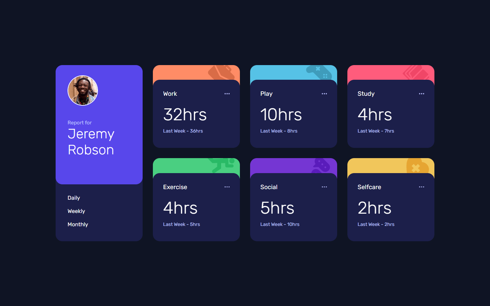
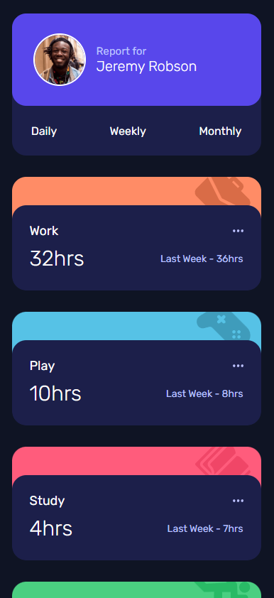

# Frontend Mentor - Time tracking dashboard solution

This is a solution to the [Time tracking dashboard challenge on Frontend Mentor](https://www.frontendmentor.io/challenges/time-tracking-dashboard-UIQ7167Jw). Frontend Mentor challenges help you improve your coding skills by building realistic projects.

## Table of contents

- [Overview](#overview)
  - [The challenge](#the-challenge)
  - [Screenshot](#screenshot)
  - [Links](#links)
- [My process](#my-process)
  - [Built with](#built-with)
  - [What I learned](#what-i-learned)

## Overview

### The challenge

Users should be able to:

- View the optimal layout for the site depending on their device's screen size
- See hover states for all interactive elements on the page
- Switch between viewing Daily, Weekly, and Monthly stats

### Screenshot





### Links

- Solution URL: [Add solution URL here](https://your-solution-url.com)
- Live Site URL: [Add live site URL here](https://your-live-site-url.com)

## My process

### Built with

- Semantic HTML5 markup
- CSS custom properties
- Flexbox
- CSS Grid
- Mobile-first workflow
- Vanilla script

### What I learned

Improve the responsive design and javascript

```html
<!DOCTYPE html>
<html lang="en">
  <head>
    <meta charset="UTF-8" />
    <meta name="viewport" content="width=device-width, initial-scale=1.0" />
    <!-- displays site properly based on user's device -->
    <link rel="stylesheet" href="./styles/style.css" />
    <link rel="preconnect" href="https://fonts.googleapis.com" />
    <link rel="preconnect" href="https://fonts.gstatic.com" crossorigin />
    <link
      href="https://fonts.googleapis.com/css2?family=Rubik:ital,wght@0,300..900;1,300..900&display=swap"
      rel="stylesheet"
    />
    <script src="./js/script.js" defer></script>
    <title>Frontend Mentor | Time tracking dashboard</title>
  </head>
  <body>
    <main class="container">
      <article class="personal-calendar">
        <section class="personal">
          <div class="personal-container">
            
            <div class="report-name">
              <span class="report">Report for</span>
              <span class="name">Jeremy Robson</span>
            </div>
          </div>
        </section>
        <nav class="calendar">
          <div class="time">
            <span id="day" class="days">Daily</span>
            <span id="week" class="days">Weekly</span>
            <span id="month" class="days">Monthly</span>
          </div>
        </nav>
      </article>
      <article class="work">
        <section class="upper-image work-image">
          
        </section>
        <section class="container-task">
          <div class="task">
            <div class="title-ellipsis">
              <span class="title">Work</span>
              
            </div>
            <div class="hours-weeks-hours">
              <span id="work-actual" class="hours"></span>
              <span class="weeks-hours"><span id="work-last"></span></span>
            </div>
          </div>
        </section>
      </article>
      <article class="play">
        <section class="upper-image play-image">
          
        </section>
        <section class="container-task">
          <div class="task">
            <div class="title-ellipsis">
              <span class="title">Play</span>
              
            </div>
            <div class="hours-weeks-hours">
              <span id="play-actual" class="hours"></span>
              <span class="weeks-hours"><span id="play-last"></span></span>
            </div>
          </div>
        </section>
      </article>
      <article class="study">
        <section class="upper-image study-image">
          
        </section>
        <section class="container-task">
          <div class="task">
            <div class="title-ellipsis">
              <span class="title">Study</span>
              
            </div>
            <div class="hours-weeks-hours">
              <span id="study-actual" class="hours"></span>
              <span class="weeks-hours"><span id="study-last"></span></span>
            </div>
          </div>
        </section>
      </article>
      <article class="exercise">
        <section class="upper-image exercise-image">
          
        </section>
        <section class="container-task">
          <div class="task">
            <div class="title-ellipsis">
              <span class="title">Exercise</span>
              
            </div>
            <div class="hours-weeks-hours">
              <span id="exercise-actual" class="hours"></span>
              <span class="weeks-hours"><span id="exercise-last"></span> </span>
            </div>
          </div>
        </section>
      </article>
      <article class="social">
        <section class="upper-image social-image">
          
        </section>
        <section class="container-task">
          <div class="task">
            <div class="title-ellipsis">
              <span class="title">Social</span>
              
            </div>
            <div class="hours-weeks-hours">
              <span id="social-actual" class="hours"></span>
              <span class="weeks-hours"><span id="social-last"></span> </span>
            </div>
          </div>
        </section>
      </article>
      <article class="selfcare">
        <section class="upper-image selfcare-image">
          
        </section>
        <section class="container-task">
          <div class="task">
            <div class="title-ellipsis">
              <span class="title">Selfcare</span>
              
            </div>
            <div class="hours-weeks-hours">
              <span id="selfcare-actual" class="hours"></span>
              <span class="weeks-hours"><span id="selfcare-last"></span> </span>
            </div>
          </div>
        </section>
      </article>
    </main>
  </body>
</html>
```

```css
/* ---- RESPONSIVE DESIGN ----*/

@media (min-width: 401px) and (max-width: 800px) {
  .container {
    width: 750px;
    gap: 30px;
  }

  .name {
    font-size: 30px;
  }

  .container-task .task .hours {
    font-size: 30px;
  }

  .task {
    padding: 30px 20px 40px;
  }

  .container-task .task .weeks-hours {
    margin: 0;
    font-size: 12px;
  }

  .container .container-task .task .hours-weeks-hours {
    display: flex;
    flex-direction: column;
    justify-content: center;
    align-items: start;
    margin-top: 20px;
  }
}

@media (max-width: 400px) {
  body {
    align-items: flex-start;
    justify-content: center;
    height: auto;
  }
  .container {
    margin-top: 20px;
    display: flex;
    flex-direction: column;
    gap: 30px;
    width: 90%;
    height: auto;
    justify-content: center;
  }

  .personal-calendar {
    height: 200px;
  }
  .personal {
    height: 130px;
    width: 100%;
    display: flex;
    justify-content: center;
    align-items: center;
  }

  .personal-calendar .personal .personal-container {
    padding: 30px 0 30px 30px;
    display: flex;
    flex-direction: row;
    align-items: center;
    justify-content: start;
    gap: 15px;
    width: 100%;
  }

  .personal-container .report-name .report {
    margin: 0;
  }

  .report-name {
    margin: 0;
    display: flex;
    flex-direction: column;
  }
  .personal .personal-container .name {
    font-size: 20px;
  }

  .personal-calendar .personal .photo {
    width: 70px;
    height: 70px;
  }

  .container .calendar .time {
    padding: 0;
    height: 70px;
    display: flex;
    flex-direction: row;
    justify-content: space-around;
    align-items: center;
  }

  .container .work {
    height: 160px;
    width: 100%;
  }

  .container .play {
    height: 160px;
    width: 100%;
  }

  .container .study {
    height: 160px;
    width: 100%;
  }

  .container .exercise {
    height: 160px;
    width: 100%;
  }

  .container .social {
    height: 160px;
    width: 100%;
  }

  .container .selfcare {
    height: 160px;
    width: 100%;
  }

  .container-task {
    height: 120px;
  }

  .task {
    padding: 25px;
    gap: 10px;
  }

  .task .weeks-hours {
    margin: 0;
  }

  .container .container-task .task .hours-weeks-hours {
    display: flex;
    flex-direction: row;
    justify-content: space-between;
    width: 100%;
    align-items: center;
  }

  .hours-weeks-hours .hours {
    font-size: 30px;
  }
}
```

```js
document.addEventListener("DOMContentLoaded", () => {
  console.log("script cargado");
  clickDaily = document.getElementById("day");
  clickWeek = document.getElementById("week");
  clickMonth = document.getElementById("month");

  const ids = [
    { title: "Work", actual: "work-actual", last: "work-last" },
    { title: "Play", actual: "play-actual", last: "play-last" },
    { title: "Study", actual: "study-actual", last: "study-last" },
    { title: "Exercise", actual: "exercise-actual", last: "exercise-last" },
    { title: "Social", actual: "social-actual", last: "social-last" },
    { title: "Self Care", actual: "selfcare-actual", last: "selfcare-last" },
  ];

  let data = [];

  fetch("/data.json")
    .then((response) => response.json())
    .then((json) => {
      data = json;
      showData("weekly");
    });

  function showData(period) {
    data.forEach((item, i) => {
      const actual = document.getElementById(ids[i].actual);
      const last = document.getElementById(ids[i].last);

      if (actual && last) {
        actual.textContent = item.timeframes[period].current + "hrs";
        let textLast = "";
        if (period === "daily") textLast = "Yesterday - ";
        else if (period === "weekly") textLast = "Last Week - ";
        else if (period === "monthly") textLast = "Last Month - ";

        last.textContent = textLast + item.timeframes[period].previous + "hrs";
      }
    });
  }

  clickDaily.addEventListener("click", () => showData("daily"));
  clickWeek.addEventListener("click", () => showData("weekly"));
  clickMonth.addEventListener("click", () => showData("monthly"));
});
```
